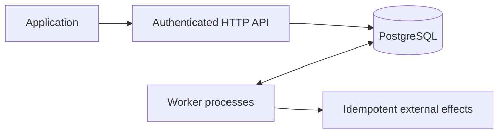

# Workflow Engine

A TypeScript and PostgreSQL workflow engine for a single trusted application environment. Applications submit versioned workflows over HTTP; separate workers execute durable steps with retries, recovery, cancellation, and deadlines.

## Quick start (Windows PowerShell)

Requirements: Node.js 24, npm, and Docker Desktop running Linux containers.

```powershell
npm.cmd ci
npm.cmd run setup
docker compose up -d postgres
npm.cmd run migrate
npm.cmd run build
```

For the existing tutorial database that already has migrations 001–008, run this once instead of the first migrate command:

```powershell
npm.cmd run migrate -- --baseline-existing
```

The migration runner checks the existing schema, records migration checksums, and applies new migrations. Later, use npm.cmd run migrate normally. Never edit an applied migration; add another numbered file.

Start the API and worker in separate terminals:

```powershell
npm.cmd run api
npm.cmd run worker
```

Then run a real application integration example:

```powershell
npm.cmd run example
```

The example loads the API key from .env, submits the same request twice, verifies one execution ID, waits for the worker, and prints the completed result and metrics. The retry demo intentionally loses two simulated payment acknowledgements before succeeding.

On macOS/Linux use npm instead of npm.cmd. Setup creates random local database credentials and an API key, preserving an existing .env. Keep .env private. To inspect or copy your key locally, open .env; scripts do not print it.

## What is included

- PostgreSQL-backed queue, saved inputs and JSON step outputs.
- Atomic work claiming, renewable leases, generation checks, recovery after process termination.
- Exponential retry schedules with saved deadlines and bounded attempts.
- Submission idempotency and idempotent simulated payment effects.
- Cancellation and whole-execution timeouts.
- Version-pinned execution and worker version selection.
- Explicit failed-run retry with preserved completed steps and audited previous attempts.
- Bearer API authentication, filtered execution listing, cursor pagination, readiness and worker monitoring.
- Tracked migrations, repeatable local setup, container deployment, integration example, and CI tests.

## HTTP API

All routes except GET /health/live require Authorization: Bearer <API_KEY>. The factory can omit authentication for isolated tests; the executable API always requires a valid key.

| Method | Route | Purpose |
|---|---|---|
| GET | /workflows | Workflow names and registered versions |
| POST | /executions | Submit workflowName, optional workflowVersion, input, timeoutMs |
| GET | /executions | List runs; filters: status, workflowName, limit (1–100), cursor |
| GET | /executions/:id | Saved input, step results, attempts, version, retry count, deadline |
| POST | /executions/:id/cancel | Cancel pending/running work |
| POST | /executions/:id/retry | Retry a failed run; requires Idempotency-Key |
| GET | /executions/:id/retries | Prior attempt snapshots and retry timestamps |
| GET | /health/live | Public process liveness |
| GET | /health/ready | Database/schema readiness |
| GET | /metrics | Counts by status and recent worker heartbeat records |

Submission example:

```json
{
  "workflowName": "fulfil-order",
  "workflowVersion": 1,
  "input": { "orderId": "ORD-123", "amount": 2500000, "currency": "NGN" },
  "timeoutMs": 60000
}
```

The amount is in minor units (this is NGN 25,000). Payments and delivery are simulated.

Use Idempotency-Key on POST /executions to retry uncertain HTTP responses safely. Same key plus same workflow, version, input and timeout returns current state; changed data returns 409. Keys do not expire. Missing input and null are equivalent; object property order does not matter.

A retry-control key is scoped to its execution. Repeating it never resets the run again, even after another failure. Use a new key for an intentional new recovery round.

Common statuses: 202 accepted/retried, 200 read/cancel, 400 invalid request, 401 invalid credentials, 404 missing resource/version, 409 state or idempotency conflict, 413 oversized body, 415 wrong content type, 503 monitoring unavailable.

## Workflow authoring and versioning

Register definitions in src/workflow-registry.ts. A definition has name, version (defaults to 1), optional validateInput, and named steps. Return JSON from a step to save its output. Read input and outputs from the step context. Names must be unique within a definition.

Create a NEW version for changed behavior and keep old definitions registered. Submission without workflowVersion selects the highest registered version. Existing rows are migrated to version 1. Workers claim only the versions they have loaded; unsupported versions stay queued for a compatible worker. Deploy compatible workers before submitting a new version.

Version numbers pin code selection, not executable code storage: retain the old implementation in source control and deployment artifacts. Modifying the implementation of an already-used version violates the contract.

## Failed execution recovery

POST /executions/:id/retry only accepts failed executions whose previous owner has released or lost its lease. It preserves completed steps and outputs, snapshots prior step attempts/errors into history, resets unfinished steps' attempt budgets, and queues the same ID. A configured timeout gets a fresh deadline for this explicit recovery round.

Effect keys remain executionId:stepIndex, so an already-created payment is reused. Attempts in current step records are for the current recovery round; GET /retries retains earlier rounds. Version and input do not change.

Completed, cancelled, or timed-out runs cannot be retried with this endpoint. Submit a new execution if a separate run is intended. Retrying an ordinary permanent business error is a deliberate operator decision, not an automatic loop.

## Container deployment

```powershell
npm.cmd run setup
docker compose -p workflow-release -f compose.release.yaml up --build -d
npm.cmd run example
docker compose -p workflow-release -f compose.release.yaml logs --tail 100 api worker
docker compose -p workflow-release -f compose.release.yaml down
```

This uses its own PostgreSQL volume and automatic migrations; it does not reuse the tutorial database. Both use localhost:3000 by default. To run alongside a local API, set API_PUBLISHED_PORT=3001 for Compose and API_URL=http://127.0.0.1:3001 for the client example. Database credentials must be URL-safe in the container connection URL; generated credentials are safe. Do not add -v to down unless intentionally deleting that deployment's data.

Only the API is exposed, on loopback. The worker and database stay on the Compose network. Images run the application as a non-root user. For public hosting, terminate TLS at a reverse proxy and supply credentials through your deployment's secret mechanism.

## Verification

```powershell
npm.cmd run build
npm.cmd test
npm.cmd run example
```

Database tests create isolated random schemas and remove only those schemas. They do not truncate application data. Coverage includes concurrent claimers, real process termination/restart, fencing, retries, JSON persistence, cancellation races, deadlines, idempotency, authentication, version routing, retry history, monitoring and fresh migrations.

CI runs the build and tests against PostgreSQL 17 on Node 24.

## Architecture and boundaries



Workflow execution is at-least-once. Database progress is protected against stale workers, but an external side effect can succeed before its checkpoint is saved. External providers must support idempotency or reconciliation. Cancellation and timeout signal cooperative handlers; they do not undo effects or kill arbitrary JavaScript.

This release is single-tenant: every holder of the shared API key can inspect and control every execution. It does not provide per-user roles or tenant isolation. It also does not include parallel/DAG execution, a visual editor, compensation, cron scheduling, or real payments.

Before a public production launch: add environment-specific load tests, alert routing, backup/restore verification, key rotation procedures and a security review. These are deployment work beyond this portfolio release.

See [Operations](docs/operations.md), [Retry behavior](docs/retries.md), [Worker behavior](docs/workers.md), [Data](docs/workflow-data.md), [Cancellation](docs/cancellation.md), and [Timeouts](docs/timeouts.md).
